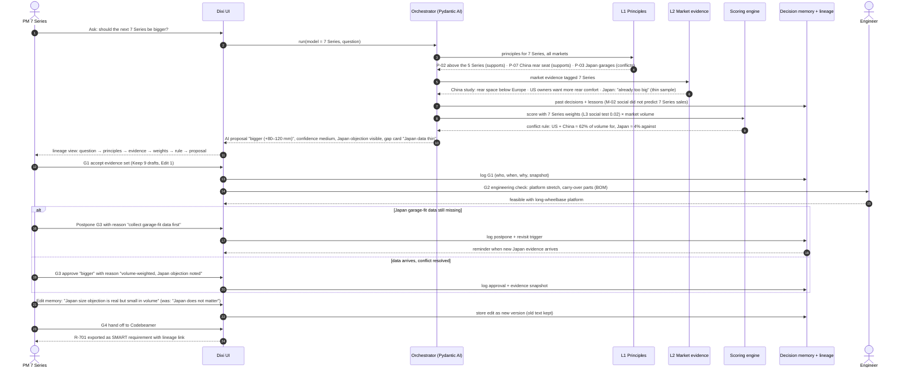

# Feedback loop: one decision end to end

One decision end to end, as a sequence: "Should the next 7 Series be bigger?" including postpone and a memory edit.

```mermaid
sequenceDiagram
  %% Flagship demo: "Should the next 7 Series be bigger?" (Japan vs US/China, resolved by volume)
  autonumber
  actor PM as PM 7 Series
  participant UI as Dixi UI
  participant OR as Orchestrator (Pydantic AI)
  participant PR as L1 Principles
  participant EV as L2 Market evidence
  participant SC as Scoring engine
  participant DM as Decision memory + lineage
  actor ENG as Engineer

  PM->>UI: Ask: should the next 7 Series be bigger?
  UI->>OR: run(model = 7 Series, question)
  OR->>PR: principles for 7 Series, all markets
  PR-->>OR: P-02 above the 5 Series (supports) · P-07 China rear seat (supports) · P-03 Japan garages (conflicts)
  OR->>EV: market evidence tagged 7 Series
  EV-->>OR: China study: rear space below Europe · US owners want more rear comfort · Japan: "already too big" (thin sample)
  OR->>DM: past decisions + lessons (M-02 social did not predict 7 Series sales)
  OR->>SC: score with 7 Series weights (L3 social test 0.02) × market volume
  SC-->>OR: conflict rule: US + China ≈ 62% of volume for, Japan ≈ 4% against
  OR-->>UI: AI proposal "bigger (+80–120 mm)", confidence medium, Japan objection visible, gap card "Japan data thin"
  UI-->>PM: lineage view: question → principles → evidence → weights → rule → proposal
  PM->>UI: G1 accept evidence set (Keep 9 drafts, Edit 1)
  UI->>DM: log G1 (who, when, why, snapshot)
  UI->>ENG: G2 engineering check: platform stretch, carry-over parts (BOM)
  ENG-->>UI: feasible with long-wheelbase platform
  alt Japan garage-fit data still missing
    PM->>UI: Postpone G3 with reason "collect garage-fit data first"
    UI->>DM: log postpone + revisit trigger
    DM-->>UI: reminder when new Japan evidence arrives
  else data arrives, conflict resolved
    PM->>UI: G3 approve "bigger" with reason "volume-weighted, Japan objection noted"
    UI->>DM: log approval + evidence snapshot
  end
  PM->>UI: Edit memory: "Japan size objection is real but small in volume" (was: "Japan does not matter")
  UI->>DM: store edit as new version (old text kept)
  PM->>UI: G4 hand off to Codebeamer
  UI-->>PM: R-701 exported as SMART requirement with lineage link
```
