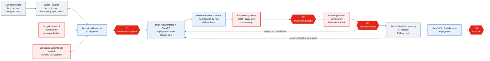

# Human-in-the-loop map

Where the human sits in the pipeline, and why.

```mermaid
flowchart LR
  %% Human-in-the-loop map: pipeline steps from sample-data.js, coloured by mode, with gates G1–G4.
  %% Placement rule: a human sits where a step is hard to reverse, needs unwritten knowledge,
  %% or carries legal or brand risk. AI runs where steps are cheap to redo and easy to check.

  collect["Collect sources<br/><i>AI on its own</i><br/>cheap to redo"]
  label["Label + cluster<br/><i>AI on its own</i><br/>5% weekly spot check"]
  principles["Set principles L1<br/><i>human only</i><br/>manager decides"]
  weights["Set source weights per model<br/><i>human, AI suggests</i>"]
  evidence["Accept evidence set<br/><i>AI proposes</i>"]
  draft["Draft requirements + SMART<br/><i>AI proposes ~90%</i><br/>Keep / Edit"]
  conflict["Resolve market conflicts<br/><i>AI proposes by rule</i><br/>PM confirms"]
  engineering["Engineering check<br/>BOM · carry-over<br/><i>human only</i>"]
  prioritise["Freeze priorities<br/><i>human only</i><br/>PM owns the list"]
  memory["Record decision memory<br/><i>AI records</i><br/>PM can edit"]
  handoff["Hand off to Codebeamer<br/><i>AI proposes</i>"]

  G1{{"G1<br/>evidence accepted"}}
  G2{{"G2<br/>engineering check"}}
  G3{{"G3<br/>priorities frozen"}}
  G4{{"G4<br/>hand-off"}}

  collect --> label --> evidence
  principles --> evidence
  weights --> evidence
  evidence --> G1 --> draft --> conflict --> engineering --> G2 --> prioritise --> G3 --> memory --> handoff --> G4
  G3 -. "postpone: revisit later" .-> draft
  memory -. "lessons feed the next draft" .-> draft

  classDef auto fill:#eef1f6,stroke:#5b6676,color:#121722
  classDef propose fill:#e8f0fc,stroke:#1c69d4,color:#121722
  classDef human fill:#fdecea,stroke:#e22718,color:#121722,stroke-width:2px
  classDef gate fill:#e22718,stroke:#e22718,color:#ffffff

  class collect,label,memory auto
  class evidence,draft,conflict,handoff propose
  class principles,weights,engineering,prioritise human
  class G1,G2,G3,G4 gate
```
