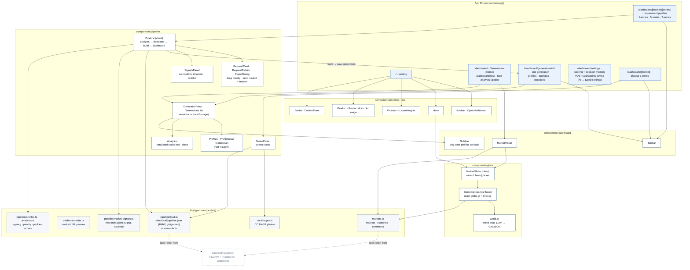

# Web app

The current Next.js app: routes, components (incl. the requirement pipeline), shared globe, data modules, planned backend.

```mermaid
flowchart TB
  %% Dixi web app (web/): Next.js 16 App Router, React 19, Tailwind v4. Current state.
  classDef route fill:#eaf2fd,stroke:#1c69d4,color:#0d1b2a
  classDef comp fill:#ffffff,stroke:#0f3d75,color:#0d1b2a
  classDef data fill:#f5f7fb,stroke:#6b7a8f,color:#0d1b2a
  classDef future fill:#ffffff,stroke:#98a2b3,color:#6b7a8f,stroke-dasharray: 4 3

  subgraph Routes["App Router (web/src/app)"]
    R1["/ · landing"]:::route
    R2["/dashboard · Generations (home)<br/>/dashboard/new · New analysis (globe)"]:::route
    R5["/dashboard/generations#id · one generation<br/>profiles · analytics · decisions"]:::route
    R6["/dashboard/settings · scoring + decision memory<br/>POST /api/scoring-advice (AI → typed settings)"]:::route
    R3["/dashboard/[market] · choose a series"]:::route
    R4["/dashboard/[market]/[series] · requirement pipeline<br/>1-series · 5-series · 7-series"]:::route
  end

  subgraph Landing["components/landing + site"]
    NAV[Navbar · Open dashboard]:::comp
    HERO[Hero]:::comp
    PROC[Process + LayerWeights]:::comp
    PROD[Product · ProductMock · AI image]:::comp
    FOOT[Footer · ContactForm]:::comp
  end

  subgraph Globe["components/globe"]
    MG["MarketGlobe (client)<br/>variant: hero | picker"]:::comp
    GC["GlobeCanvas (ssr:false)<br/>react-globe.gl + three.js"]:::comp
    W["world.ts<br/>world-atlas 110m → GeoJSON"]:::comp
  end

  subgraph Dash["components/dashboard"]
    MP[MarketPicker]:::comp
    TB[TopBar]:::comp
    SB["Sidebar<br/>only after profiles are built"]:::comp
  end

  subgraph Pipe["components/pipeline"]
    SP["SeriesPicker<br/>photo cards"]:::comp
    PL["Pipeline (client)<br/>analysis → decisions → build → dashboard"]:::comp
    RC["RequestCard · RequestDetails · RejectDialog<br/>drag priority · keep / reject + reason"]:::comp
    SG["SignalsPanel<br/>competitors &amp; trends · wishlist"]:::comp
    GV["GenerationView · Generations list<br/>sessions.ts (localStorage)"]:::comp
    PR["Profiles · ProfileDetail (catalogue)<br/>PDF via print"]:::comp
    AN["Analytics<br/>simulated social test · chart"]:::comp
  end

  subgraph Lib["lib (typed sample data)"]
    MK["markets.ts<br/>markets · countries · comments"]:::data
    DD["dashboard-data.ts<br/>market URL params"]:::data
    PD["pipeline/load.ts<br/>data-local/pipeline.json (BMW, git-ignored)<br/>or example.ts"]:::data
    MS["pipeline/market-signals.ts<br/>research agent output, sourced"]:::data
    PF["pipeline/profiles.ts · analytics.ts<br/>urgency · priority · profiles · scores"]:::data
    CI["car-images.ts<br/>CC BY-SA photos"]:::data
  end

  API["backend/ (planned)<br/>FastAPI + Pydantic AI · Supabase"]:::future

  R1 --> NAV & HERO & PROC & PROD & FOOT
  HERO --> MG
  R2 --> MP --> MG
  R3 --> TB & SP
  R4 --> TB & PL
  PL --> RC & SG
  PL -- "build → save generation" --> R5
  R5 --> TB & GV
  GV --> PR & AN & SB
  R2 --> GV
  SP --> CI & PD
  PL --> PD & MS & PF
  MG --> GC --> W
  GC --> MK
  MP --> MK
  PD -. "later: fetch from" .-> API
  MK -. "later: fetch from" .-> API
```
